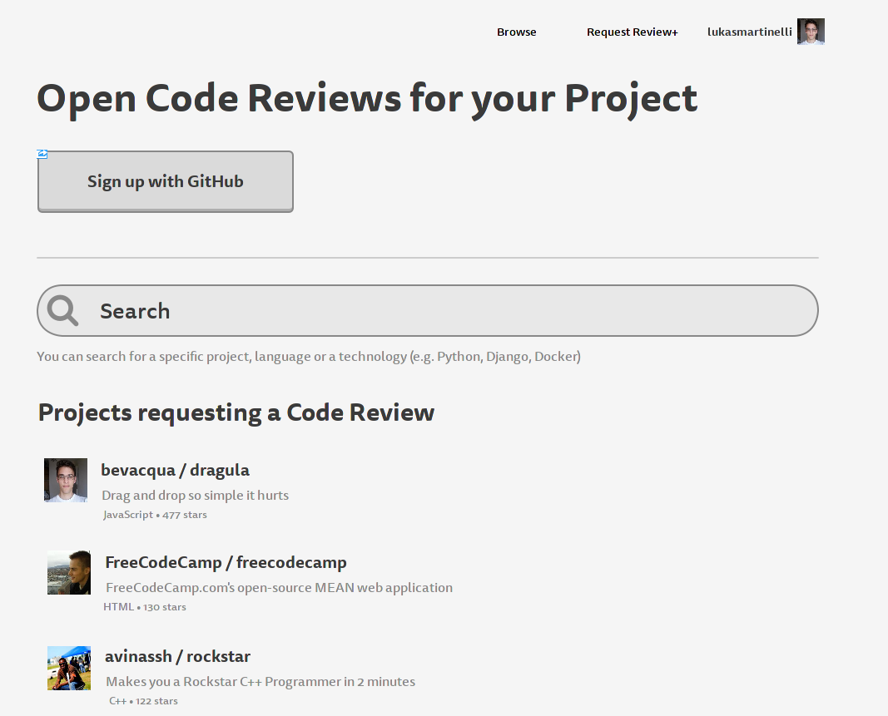

# opencodereview

A platform for finding code reviewers for your GitHub project.

Developers often work on their Open Source project and want
input or a code review for their project.
However finding a reviewer becomes tricky if you don't know
the people personally.

A platform where GitHub projects can be submitted for reviews
and voluntary reviewers can find interesting projects
would help improving the quality and visibility
of many projects.

The platform only works if there are enough reviewers.
The principle of "Give and Take" is similar to
[couchsurfing](https://www.couchsurfing.com/) or
[warmshowers](https://www.warmshowers.org/) where the
community organizes itself. People who submit a project
for a review should be willing to review projects themselves.

## Use Cases

- Joe is a Pythonista but is creating a cool new project in Go
  with which he is unfamiliar with.
  He would like someone with more expertise to take a look at his
  project and tell him where he could write more idiomatic code
  or whether he writes readable Go code.
- Joe on his part reviews a Django (a technology he has created many cool
  websites with) project and gives feedback about best practices.

## Opensource Reviews today

Opensource reviews already happen today in various forms:

- Security Audits (often payed)
- Blog posts (like http://ayende.com/blog/2976/code-review-petshop-3-0)
- Pull requests
- Issues
- Per mail (if explicitely asked by someone else)

The platform is independent from the form of the review, it is only the
mediator. Reviewers can use any form they like.

## Onboarding

In order to review projects or get your project reviewed
you simply sign up with your GitHub account.

From the GitHub account we can pull all the projects
the user worked on and create a profile
(similar to the [Github resume](https://resume.github.io/)):

- Languages used
- Technologies used
- Location
- Contact possibilities

## Submit project

The user chooses a repository from his GitHub account and
describes what he expects from a review and in which form
he would like the review.
After that the platform takes over and constantly looks for
reviewers that match the project profile.

## Mediating reviewers and projects

The web application is only the mediator between
the reviewer and the project. The review itself can happen
anywhere (via GitHub issue, email or blog post).

The only data about the review itself is provided via an optional URL
to the completed review.

The platform tracks who reviewed what and provided which projects.

The platform helps matching appropriate projects to
appropriate viewers by looking at the qualifiers collected
from the GitHub account:
- Similarity in projects (many Django projects)
- Expertise in Language (via published repositories)
- Developers with more stars are usually more popular
- Location / Language (preferably from same country or region)

## Project search

Users can search for a project by providing
- technology (e.g. "Django", "Rails", "Meteor", "Node")
- programming language (e.g. "python", "Ruby", "JavaScript")
- project name (e.g. "chromium")
- project owner (e.g. "lukasmartinelli")
- project description (e.g. "ast parser")

## Project

GitHub data:

- Project name
- Repository link
- Description
- Languages / Technologies used
- Code statistics (SLOC, language percentage)

Additional data:

- What is expected from the review
- Desired form of review

## Reviewer

- Projects reviewed by reviewer
- Qualifiers extracted from GitHub Profile
- Projects submitted for review

> Idea: Show interactions (reviews and requests) between
  developers and projects in a graph like view
